#프로젝트명: ATmega128 기반 스마트 도어락 비밀번호 시스템 구현

**기간**: 2025. 8월 .27
개인 프로젝트

###프로젝트 개요

ATmega128 마이크로컨트롤러를 활용하여 2x16 Text LCD, 4x3 키패드, 풀컬러 LED를 연동한 임베디드 비밀번호 시스템을 개발했습니다. 이 프로젝트는 단순한 비밀번호 인증을 넘어, 직관적인 사용자 인터페이스와 관리자 모드를 통한 비밀번호 변경 기능을 제공하여 실제 응용 가능한 보안 시스템의 기본을 다졌습니다. 임베디드 시스템 개발 과정 전반에 걸쳐 하드웨어 제어와 소프트웨어 로직 구현 능력을 강화하는 데 중점을 두었습니다.

### 주요 기능 및 목표

*   **사용자 인터페이스**: 2x16 Text LCD를 통해 비밀번호 입력 안내, 입력 값 표시, 인증 결과 및 시스템 상태(관리자 모드, 비밀번호 변경)를 사용자에게 직관적으로 제공.
*   **키패드 제어**: 4x3 키패드의 스캔 로직을 직접 구현하여 사용자 입력(숫자, '*', '#')을 정확하게 감지 및 처리.
*   **시각적 피드백**: 풀컬러 LED를 활용하여 비밀번호 인증 결과(성공: 초록, 실패: 빨강) 및 시스템 대기 상태(노랑)를 즉각적으로 시각화.
*   **비밀번호 관리**:
    *   초기 비밀번호("1234567") 설정 및 인증.
    *   관리자 비밀번호("98765")를 통해 관리자 모드 진입.
    *   관리자 모드에서 기존 비밀번호를 새로운 비밀번호로 변경하는 기능 구현.
*   **시스템 안정성**: 키패드 디바운싱 처리, 안정적인 하드웨어 드라이버 개발을 통해 시스템의 견고성 확보.
*   **코드 모듈화**: LCD, 키패드, LED 제어 코드를 각각의 독립적인 모듈(`.h`, `.c` 파일)로 분리하여 재사용성 및 유지보수 용이성 증대.

### 사용 기술 스택

*   **마이크로컨트롤러(MCU)**: ATmega128
*   **프로그래밍 언어**: C
*   **개발 환경**: Microchip Studio (혹은 Atmel Studio)
*   **주요 하드웨어 구성**: 2x16 Text LCD, 4x3 키패드, Common Cathode 타입 풀컬러 LED
*   **통신/제어 방식**:
    *   **LCD**: 8-bit 병렬 통신 (GPIO 직접 제어)
    *   **키패드**: 매트릭스 스캔 방식 (GPIO 직접 제어)
    *   **LED**: GPIO On/Off 제어 (Common Cathode 방식)

### 구현 내용 및 담당 역할

본 프로젝트는 제가 단독으로 기획부터 개발, 테스트까지 전 과정을 수행했습니다.

1.  **하드웨어 인터페이스 설계**:
    *   ATmega128의 포트(PORTA, PORTC, PORTD, PORTE, PORTG)를 활용하여 LCD, 키패드, LED 각 모듈의 핀을 최적화하여 연결. 특히 주어진 2핀, 4핀, 8핀 커넥터의 제약 사항을 고려하여 효율적인 포트 할당 전략 수립.
    *   각 모듈에 필요한 클럭(`F_CPU`) 설정을 프로젝트 전반에 일관되게 적용.

2.  **모듈별 드라이버 개발**:
    *   **LCD 드라이버**: 8비트 데이터 통신 프로토콜을 구현하여 문자 출력, 커서 이동, 화면 클리어 등 LCD의 기본적인 기능을 제어하는 독립적인 `lcd.h` 및 `lcd.c` 모듈 개발.
    *   **키패드 드라이버**: 4x3 키패드의 스캔 로직을 C언어로 직접 구현하여, 눌린 키의 문자 값을 정확하게 감지하는 `keypad.h` 및 `keypad.c` 모듈 개발. 특히 입력 과정의 안정성을 위해 디바운싱(Debouncing) 로직을 적용.
    *   **LED 드라이버**: 풀컬러 LED의 개별 R, G, B 핀을 제어하여 원하는 색상을 출력하고 끄는 `led.h` 및 `led.c` 모듈 개발.

3.  **메인 로직 및 상태 관리**:
    *   `main.c`에서 `enum`을 활용한 **상태 머신(State Machine)**을 설계하여 프로그램의 복잡한 흐름(비밀번호 입력, 관리자 모드, 비밀번호 변경)을 체계적으로 관리.
    *   사용자 입력에 따라 프로그램 상태가 전환되고, 각 상태별로 정해진 동작을 수행하도록 구현.

4.  **비밀번호 로직 구현**:
    *   `strcmp()` 함수를 활용하여 입력된 비밀번호와 저장된 비밀번호를 비교하고, 성공/실패 시 적절한 피드백(LCD 메시지 및 LED 색상 변화) 제공.
    *   **다중 비밀번호 길이 처리**: 일반 사용자 비밀번호(7자리)와 관리자 비밀번호(5자리)의 길이를 구분하여 처리함으로써 유연성 확보.
    *   **비밀번호 변경**: 관리자 모드에서 새로운 7자리 비밀번호를 입력받아 `stored_password` 값을 업데이트하는 기능 구현 (초기화 방지를 위해 EEPROM 연동은 향후 개선 과제).

###  기술적 도전 및 해결 과정

1.  **키패드 매핑 변수 중복 정의 에러 (Multiple Definition Error)**
    *   **문제**: `keypad_map` 배열이 `keypad.h`와 `keypad.c`에 동시에 정의되어 `multiple definition` 컴파일 에러가 발생했습니다.
    *   **해결**: C언어의 `extern` 키워드를 사용하여 `keypad.h`에서는 `keypad_map`을 **선언**만 하고, 실제 **정의(메모리 할당)**는 `keypad.c`에서만 하도록 구조를 변경하여 링크 시점의 충돌을 방지했습니다. 이는 C언어의 컴파일 및 링크 과정에 대한 깊이 있는 이해를 요구했습니다.

2.  **LCD 커서 위치 지정 오류**
    *   **문제**: `LCD_pos(col, row)` 함수가 일반적인 2x16 LCD의 `DDRAM` 주소 체계와 불일치하여, 원하는 `(col, row)` 위치에 정확하게 문자가 출력되지 않는 문제가 있었습니다. 특히 2번째 줄(row 1)에 문자 입력이 안 되는 현상을 겪었습니다.
    *   **해결**: LCD 컨트롤러(HD44780 계열)의 `DDRAM` 주소 체계(1번째 줄: `0x00~0x0F`, 2번째 줄: `0x40~0x4F`에 각각 `0x80`, `0xC0`를 더해 명령어로 전송)를 상세히 분석하고, `LCD_pos` 함수의 내부 주소 계산 로직을 `address = 0x80 + col` (row 0일 때) 및 `address = 0xC0 + col` (row 1일 때)로 수정하여 정확한 위치에 문자를 출력할 수 있도록 문제를 해결했습니다.

3.  **키패드 입력 감지 방식 분석 및 적용**
    *   **문제**: 표준적인 키패드 스캔 방식(풀업 저항 사용 및 LOW 신호 감지)과 달리, 특정 레퍼런스 코드에서는 입력 핀이 `HIGH` 신호일 때 버튼이 눌린 것으로 감지하는 방식을 사용했습니다. 이 차이점과 하드웨어 특성을 이해하고 기존 `keypad.c` 로직에 어떻게 적용할지 판단해야 했습니다.
    *   **해결**: 키패드 각 `R0~R3` 라인에 대한 `PIND & 0x01` 등의 조건문을 `(KEYPAD_PIN & ROWx_PIN_MASK) == ROWx_PIN_MASK`와 같이 `HIGH` 신호 감지 로직으로 정확히 반영하고, `Keypad_Init` 함수에서 PORTD의 상위 4비트를 출력, 하위 4비트를 입력으로 설정하며 컬럼 선택 방식을 `HIGH`로 전환하여 전체 스캔 로직을 일관되게 구현했습니다. 이는 하드웨어 레벨에서의 핀 동작 방식과 코드의 밀접한 연관성을 이해하는 데 큰 도움이 되었습니다.

### 결과물 및 성과

본 프로젝트를 통해 ATmega128 마이크로컨트롤러를 이용한 임베디드 시스템 개발 전반에 대한 깊이 있는 경험을 쌓았습니다. 특히 하드웨어 직접 제어(GPIO), 모듈별 드라이버 개발, 상태 머신을 활용한 복잡한 로직 구현, 그리고 디버깅 및 문제 해결 능력을 효과적으로 향상시킬 수 있었습니다. 사용자 요구사항(비밀번호 변경 기능, 입력 줄 변경)에 대한 유연한 코드 확장 능력과 실시간 피드백 시스템 구현 역량을 성공적으로 보여주었습니다.

*   **프로젝트 동작 시연 영상**: https://github.com/MaINoo999/JangMinWoo.github.io/blob/86d186641ae3b5c104e52c1cb6c8b192193f17d2/Video/KakaoTalk_20250827_145832710.mp4
*   **프로젝트 이미지**: 
    * LCD 비밀번호 입력 화면: 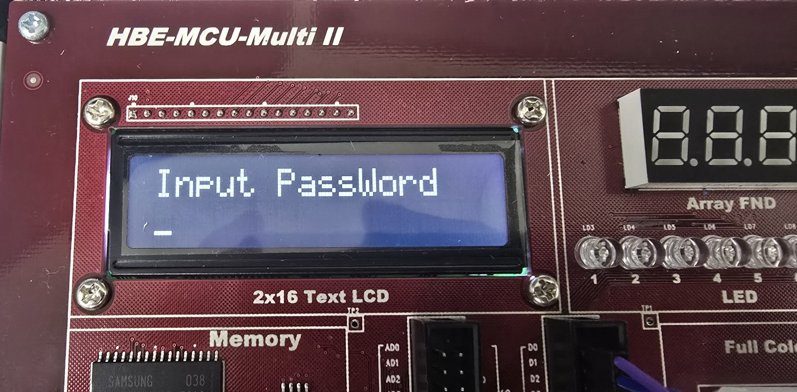
    * LCD 비밀번호 입력 화면: 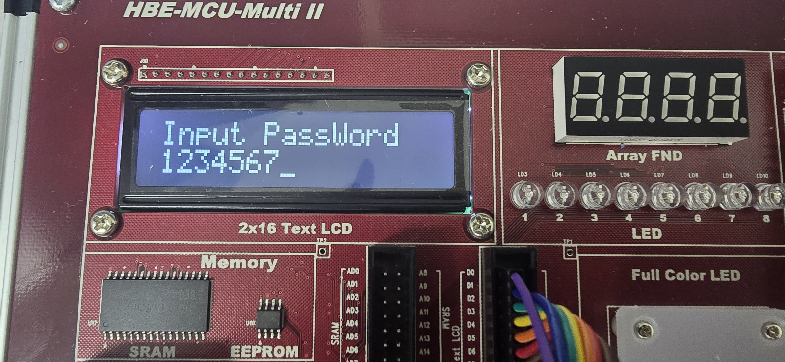
    * LCD 비밀번호 정답 화면: 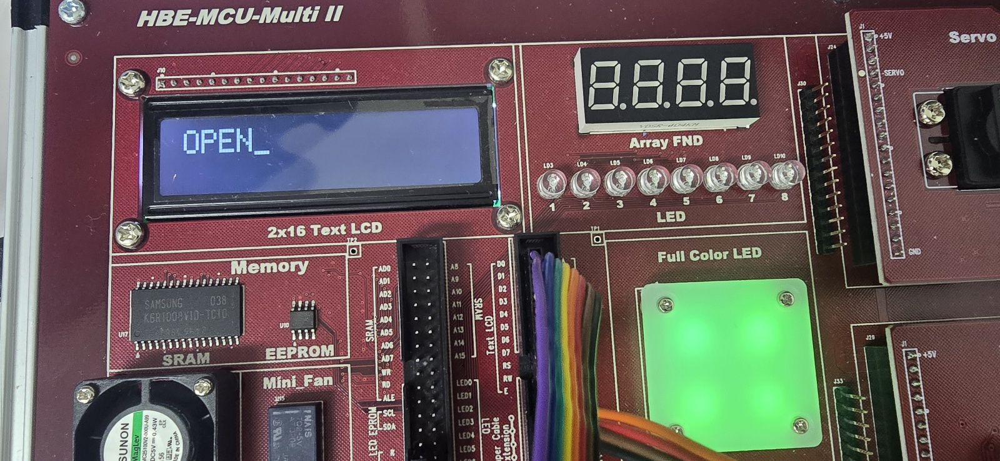
    * LCD 비밀번호 정답 입력후 초기화 화면: 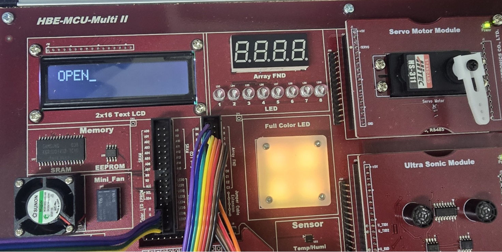
    * LCD 비밀번호 오답 화면: 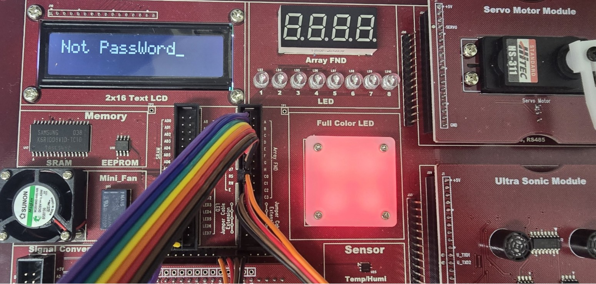
    * 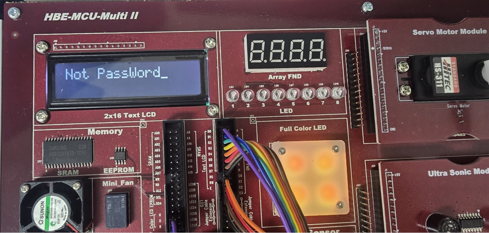
    * 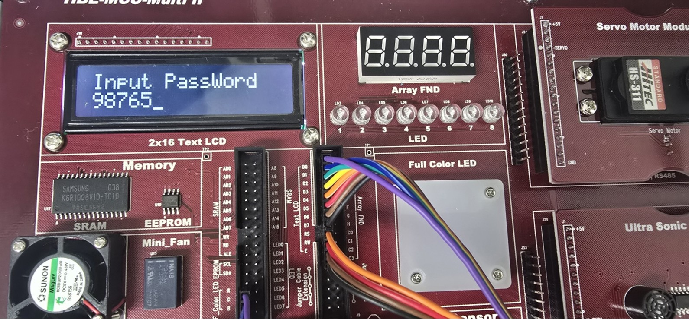
    * 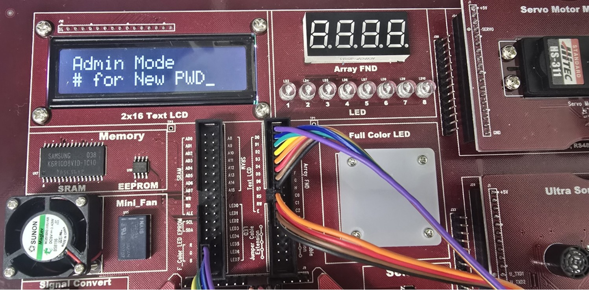
    * 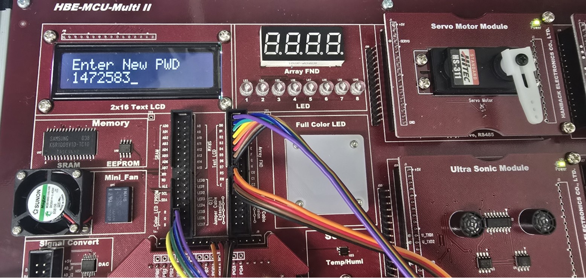
    * 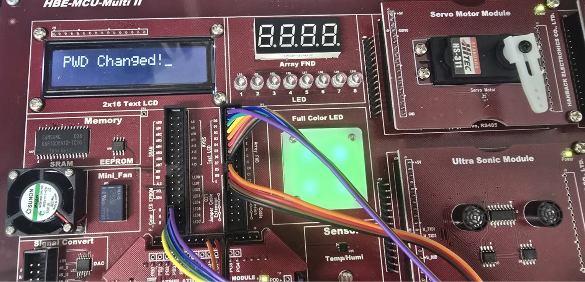
    * ![LCD 비밀번호 변경 완료 후 초기화 화면]!(images/KakaoTalk_20250827_130314875_11.jpg)
    * 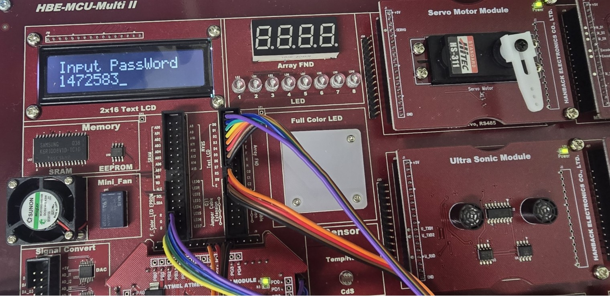
    * 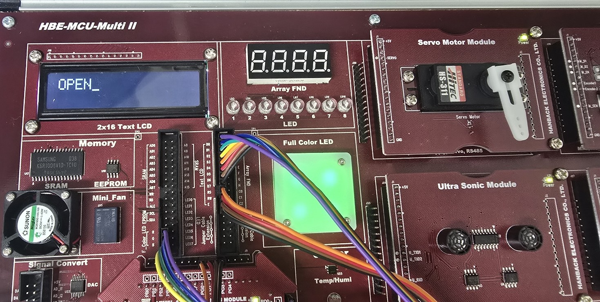

### 코드 저장소

*   **GitHub Repository**: [https://github.com/MaINoo999/JangMinWoo.github.io]
